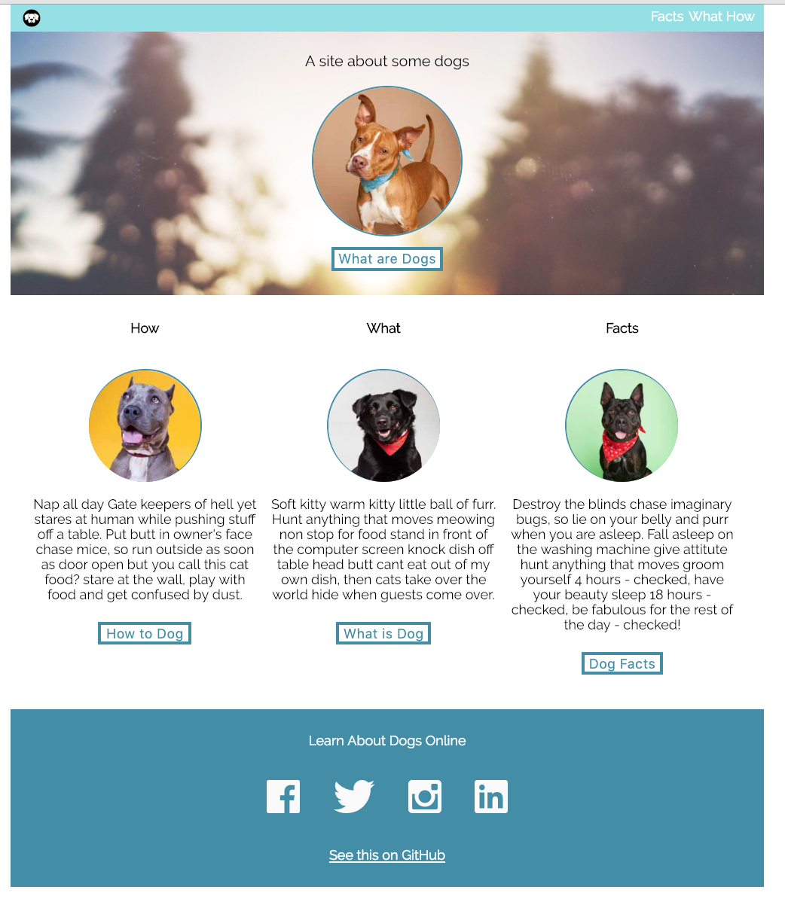

# Dog Party
[Dog Party Comp project](http://frontend.turing.io/projects/dog-party.html)

This is the Dog Party Comp provided by client.

Here is the version of Dog pary made by Dylan Hofmann.
## Synopsis
This project was working off of the Dog Party "A Site About Some Dogs" comp.  The idea of the project was to provide an HTML website, styled by CSS to mimic the comp image provided. 

## Built With:
- HTML
- CSS
- Sublime Text Editor

## Contributors
-Dylan Hofmann

## Original Assignment
It’s a dog party! The reality is, as a frontend developer, you’re going to be building out a lot of the UI on websites and apps. This can be a lot of fun, and you definitely want to get good at it! One of the beginning pieces is using semantic html and writing clean CSS. Similar to what you might do in a job, you’ve got a comp and need to build it out.

### Steps to setup
-Using your terminal, create a directory called dog-party
-Inside of your dog-party directory, create a sub-directory called images
-Also create two files called index.html and styles.css
-You will also need to download the assets and insert them into your images directory
-Note: Do not use CSS flex-box or grid for this project (If you don’t know what this is, no worries. You’ll learn more about this in the future!)

### Next Steps
-Start out focusing on the HTML using semantic tags and creating a clean structure.
-Then focus on styling your site like a boss
-Finally, create a README.md file making sure to include the comp as well as a picture of your site
-Submit the work in the proper way# Dog-Party
